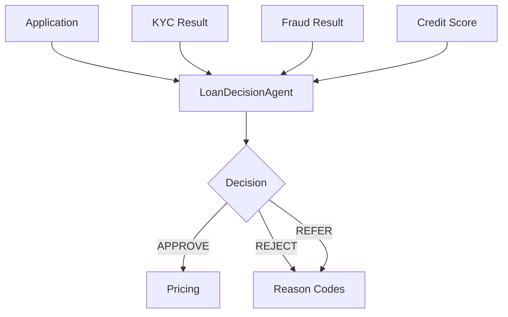

# Loan Origination and Credit Decisioning Sample

This sample demonstrates an enterprise-grade loan origination process using Oracle Database, Python 3.11, and Wayflow.

## Core Features

*   **Deterministic Workflow**: Logic execution is reproducible and verifiable.
*   **Strong Idempotency**: Requests are de-duplicated using `Idempotency-Key` backed by Oracle Database.
*   **Dry-Run Capability**: Execute decisions in a safe mode with zero side effects.
*   **Auditability**: All actions and decisions are recorded.

## Getting Started

1.  Start the infrastructure:
    ```bash
    cd ../../infra
    podman compose up -d
    ```

2.  Run the demo script:
    ```bash
    ../../tools/scripts/demo.sh
    ```

## Documentation

Detailed documentation is available in the `docs/` directory:

*   [Runbook](docs/runbook.md) - Operational guide for Enterprise Architects.
*   [Architecture](docs/runbook.md#deployment-architecture) - System diagrams.
*   [Data Model](../../infra/db/oracle/init/01_schema.sql) - Database schema.
*   [Agent Specification](../../services/decision_agent/agent_spec/manifest.yaml) - Decision logic definition.

## Decision Flow Diagram



## Directory Structure

*   `payloads/`: JSON payload examples.
*   `curl/`: Individual scripts for stepping through the API.
