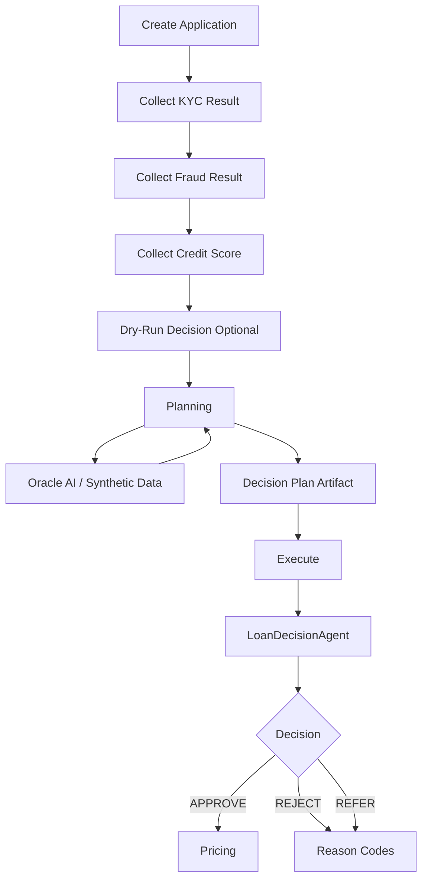
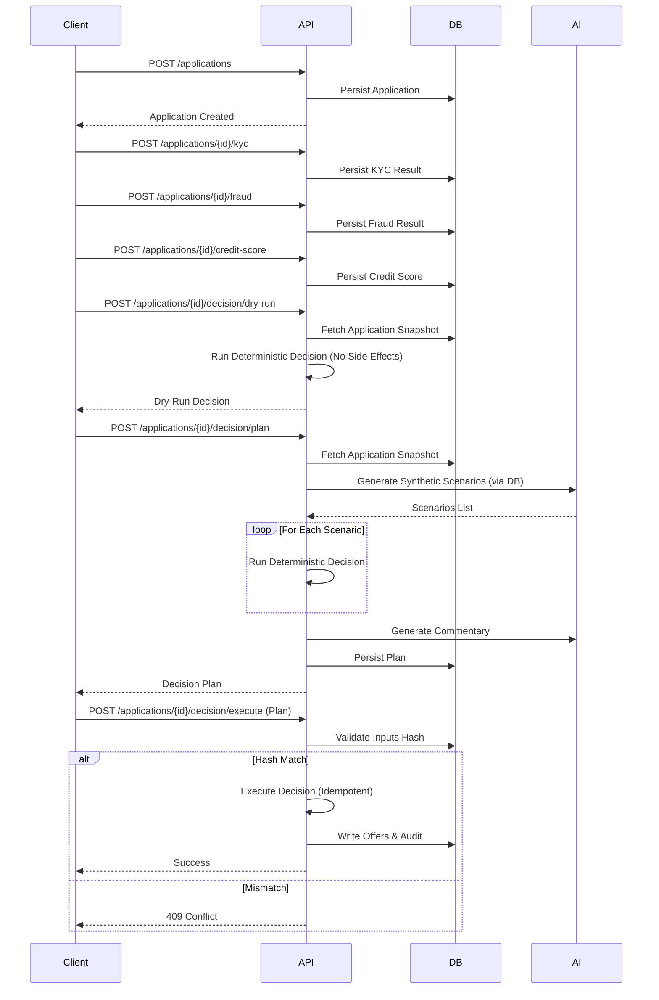
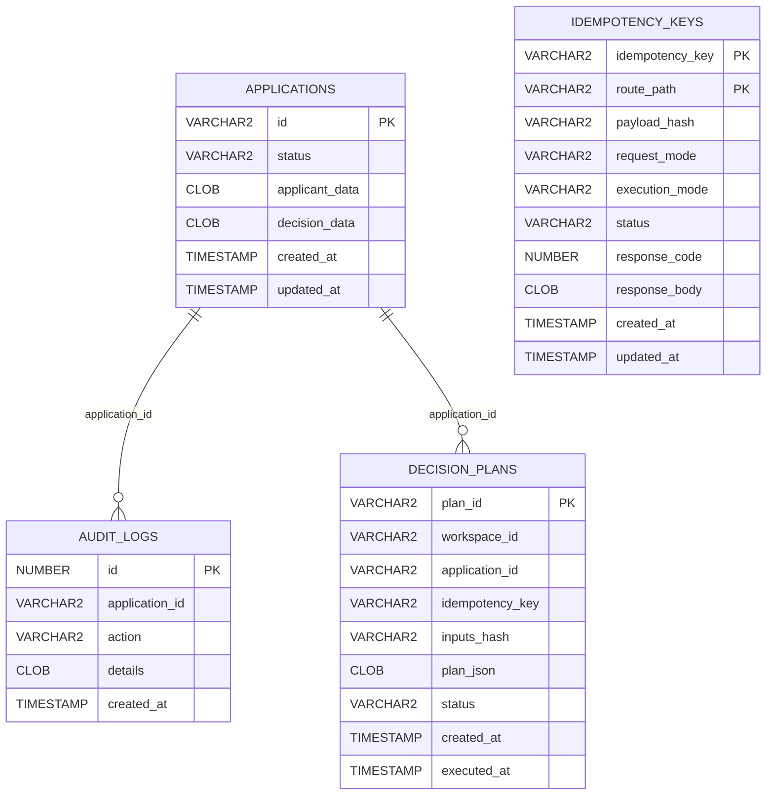

# Loan Origination and Credit Decisioning Sample

This sample demonstrates an enterprise-grade loan origination process using Oracle Database, Python 3.11, and Wayflow.

## Core Features

*   **Deterministic Workflow**: Logic execution is reproducible and verifiable.
*   **Planning & Simulation**: Generate decision plans with AI-enriched commentary and synthetic scenarios.
*   **Strong Idempotency**: Requests are de-duplicated using `Idempotency-Key` backed by Oracle Database.
*   **Dry-Run Capability**: Execute decisions in a safe mode with zero side effects.
*   **True Cache Integration**: Optional read-only caching tier for high performance.
*   **Auditability**: All actions and decisions are recorded.

## Getting Started

1.  Start the infrastructure:
    ```bash
    ./reset.sh
    ```

2.  Run the demo script:
    ```bash
    ./demo.sh
    ```

3.  Tear down everything:
    ```bash
    ./teardown.sh
    ```

### Optional Overrides

* Override API URL:
  ```bash
  API_URL=http://localhost:18000 ./demo.sh
  ```
* Override DB image/service:
  ```bash
  DB_IMAGE=container-registry.oracle.com/database/free:latest DB_SERVICE=FREEPDB1 ./reset.sh
  ```

## Documentation

Detailed documentation is available in the `docs/` directory:

*   [Runbook](docs/runbook.md) - Operational guide for Enterprise Architects.
*   [Architecture](docs/runbook.md#deployment-architecture) - System diagrams.
*   [Data Model](../../infra/db/oracle/init/01_schema.sql) - Database schema.
*   [Agent Specification](../../services/decision_agent/agent_spec/manifest.yaml) - Decision logic definition.

## Decision Flow Diagram

End-to-end workflow (embedded):



Sequence view (also embedded; source lives in `docs/workflow.mmd`):



## Database Entity Diagram



## Directory Structure

*   `payloads/`: JSON payload examples.
*   `curl/`: Individual scripts for stepping through the API.
*   `docs/`: Runbook and operational notes.
*   `demo.sh`, `reset.sh`, `teardown.sh`: Sample-local wrappers for shared scripts.
