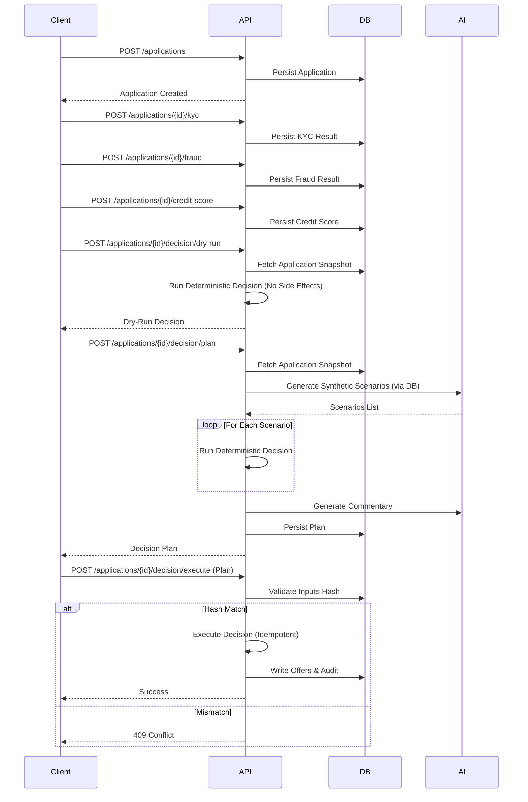
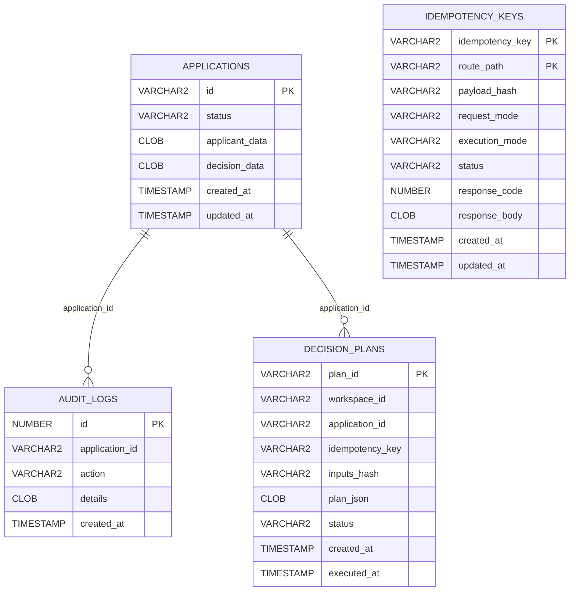

# Loan Origination Runbook

## System Overview

The Loan Origination system is a microservice-style application built with Python 3.11 and FastAPI, utilizing Oracle Database 23c/Free for persistence and concurrency control. It employs the "Wayflow" pattern for deterministic workflow execution.

## Deployment Architecture

The solution runs as a set of containerized services:

1.  **Loan API**: The main entry point, hosting the workflow engine and decision agent.
2.  **Oracle Database**: System of Record, Idempotency Store, and Audit Log.

Default Runtime: **Docker Desktop or Podman Desktop**.

## Operational Procedures

### Start-Up
From the sample directory:
```bash
./reset.sh
```
Wait for the database health check to pass.

### Reset
Run `./reset.sh` from `samples/loan-origination/` to wipe data and restart containers.

## Core Mechanisms

## End-to-End Workflow

The loan origination flow spans intake, checks, planning, and execution:

1.  **Create Application**: `POST /applications`
2.  **Collect Checks**:
    *   `POST /applications/{id}/kyc`
    *   `POST /applications/{id}/fraud`
    *   `POST /applications/{id}/credit-score`
3.  **Dry-Run Decision (Optional)**: `POST /applications/{id}/decision/dry-run`
4.  **Plan Decision**: `POST /applications/{id}/decision/plan`
5.  **Execute Decision**: `POST /applications/{id}/decision/execute`

### Workflow Diagram (Flowchart)

```mermaid
flowchart TB
  A[Create Application] --> K[Collect KYC Result]
  K --> F[Collect Fraud Result]
  F --> C[Collect Credit Score]
  C --> DR[Dry-Run Decision (Optional)]
  DR --> P[Planning]
  P --> AI[Oracle AI / Synthetic Data]
  AI --> P
  P --> Plan[Decision Plan Artifact]
  Plan --> E[Execute]
  E --> D[LoanDecisionAgent]
  D --> Dec{Decision}
  Dec -->|APPROVE| G[Pricing]
  Dec -->|REJECT| H[Reason Codes]
  Dec -->|REFER| H
```

### Workflow Diagram (Sequence)



## Database Entity Diagram



### Idempotency
All POST endpoints enforce idempotency via the `Idempotency-Key` header.
*   **Key Storage**: `idempotency_keys` table in Oracle.
*   **Uniqueness**: `(idempotency_key, route_path)`.
*   **Payload Verification**: SHA-256 hash of `canonical(body) + request_mode + execution_mode`.
*   **Behavior**:
    *   **New Key**: Process and store result.
    *   **Retry (Same Payload)**: Return cached result.
    *   **Retry (Diff Payload)**: Return HTTP 409 Conflict.
    *   **In-Progress**: Return HTTP 409 Conflict.

### Dry-Run Execution
The `/applications/{id}/decision/dry-run` endpoint executes the decision logic without committing changes to the System of Record.
*   **Workflow Mode**: `DRY_RUN`.
*   **Side Effects**: Disabled (Persistence steps are skipped).
*   **Output**: Full decision structure (Decision, Reason Codes, Pricing).

### Execute Execution
The `/applications/{id}/decision/execute` endpoint commits the decision.
*   **Workflow Mode**: `EXECUTE`.
*   **Side Effects**: Database updates, Audit logs.

### Planning & Simulation
The `/applications/{id}/decision/plan` endpoint generates a proposal before execution.
*   **AI Enrichment**: Uses Oracle AI Profile to add commentary and rationale.
*   **Synthetic Scenarios**: Generates "what-if" variations to test decision robustness.
*   **Persistence**: Plans are stored in `decision_plans` table.

### True Cache (Optional)
To enable read-only offloading:
*   Set `TRUE_CACHE_ENABLED=true`
*   Set `TRUE_CACHE_DSN=...`
The API will route GET requests to the True Cache instance.

## Troubleshooting

### Database Connectivity
Check `infra/compose.yaml` healthcheck.
Ensure the schema is initialized (the reset/demo scripts do this automatically).

### Application Logs
View logs via:
```bash
cd ../../infra
docker compose logs -f loan-api
```
Structured JSON logging is recommended for production (simplified text logging used in sample).
