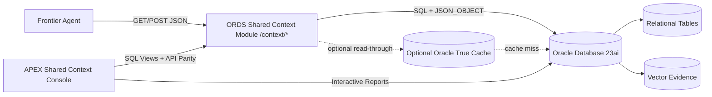
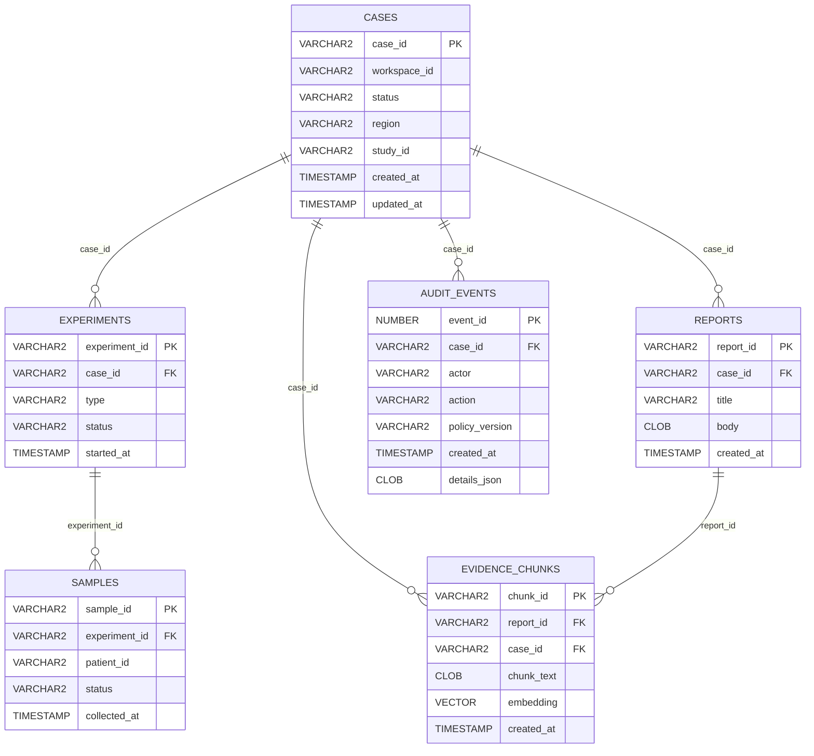

# Shared Context Layer Sample (APEX + ORDS + Oracle DB)

This sample demonstrates a **shared business context layer** for agent and human consumers using the same Oracle-backed data.

It focuses on:
- read-only context retrieval,
- relational truth + semantic evidence retrieval,
- governance and audit visibility,
- consistent JSON payloads for both agent tools and APEX UI.

## Folder Layout

```text
samples/shared-context/
  README.md
  payloads/
    curl_examples.sh
  sql/
    01_schema.sql
    02_seed.sql
    03_views.sql
    04_ords_modules.sql
  apex/
    build_guide.md
    export.sql
  diagrams/
    architecture.mmd
    entity.mmd
```

## Architecture Diagram



## Entity Diagram



## Prerequisites

- Oracle Database 23ai compatible with `VECTOR` type
- ORDS installed and reachable (local standalone/container or existing ORDS endpoint)
- Oracle APEX workspace (same DB schema)
- Tools: `sqlplus`, `curl`, optional `jq`
- Apple Silicon friendly: use `container-registry.oracle.com/database/adb-free:latest-23ai`

## Setup

1. Start Oracle DB (repo default):
```bash
source tools/scripts/env.sh
cd infra
$COMPOSE_CMD up -d db
```

2. Apply SQL in order:
```bash
cd /Users/dennisvar/Documents/nobind-projects/oracle-enterprise-samples

sqlplus sys/Welcome12345!@//localhost:11521/FREEPDB1 as sysdba @samples/shared-context/sql/01_schema.sql
sqlplus shared_ctx_user/Welcome12345!@//localhost:11521/FREEPDB1 @samples/shared-context/sql/02_seed.sql
sqlplus shared_ctx_user/Welcome12345!@//localhost:11521/FREEPDB1 @samples/shared-context/sql/03_views.sql
sqlplus shared_ctx_user/Welcome12345!@//localhost:11521/FREEPDB1 @samples/shared-context/sql/04_ords_modules.sql
```

3. Confirm ORDS base URL and run examples:
```bash
ORDS_BASE_URL=http://localhost:8080/ords/shared-context/context \
WORKSPACE_ID=WS1 \
CASE_ID=CASE-0001 \
./samples/shared-context/payloads/curl_examples.sh
```

## Endpoints

### 1) `GET /context/cases/{caseId}`
Returns canonical Context Bundle JSON with case facts, entities, evidence, governance, audit, and freshness.

Expected top-level keys:
- `case`
- `entities`
- `evidence`
- `governance`
- `audit`
- `freshness`

### 2) `POST /context/search`
Request example:
```json
{
  "query": "protocol deviation and biomarker trend",
  "filters": {
    "status": "IN_REVIEW",
    "region": "EMEA",
    "studyId": "STUDY-02"
  },
  "limit": 10
}
```

Response shape:
```json
{
  "results": [
    { "caseId": "CASE-0001", "title": "...", "score": 0.12, "status": "IN_REVIEW", "region": "EMEA" }
  ]
}
```

### 3) `GET /context/cases/{caseId}/evidence?query=...&limit=...`
Returns evidence block only; semantic ranking + relational filters (`status`, `region`, `studyId`, `fromTs`, `toTs`).

### 4) `GET /context/cases/{caseId}/audit?limit=...`
Returns recent audit events.

### Optional 5) `GET /context/health`
Returns DB health and timing.

## APEX: Shared Context Console

Build from `samples/shared-context/apex/build_guide.md`.

Pages:
1. Case Search (interactive report)
2. Case Detail (master-detail: experiments, samples, reports)
3. Evidence Search (query + filters + ranked snippets)
4. Context Bundle Preview (JSON from `sc_context_api.context_bundle_json`)
5. Audit Timeline (filterable recent events)

## True Cache Notes (Optional)

This sample is read-heavy and suitable for optional read acceleration.

Suggested integration points:
- cache hot context bundle lookups by `(workspace_id, case_id)`
- cache top evidence blocks for common query patterns

Metrics to monitor:
- ORDS latency p50/p95 for `/context/cases/{caseId}`
- DB CPU and logical reads per request
- cache hit ratio for case/evidence endpoints

## Security Notes

- Endpoints are workspace-scoped via `workspace_id` parameter (`workspaceId` query param).
- AuthN/AuthZ integration is intentionally left as a placeholder for environment-specific implementation.
- All endpoints are read-only.

## Quick Validation Commands

```bash
curl -s "http://localhost:8080/ords/shared-context/context/health" | jq
curl -s "http://localhost:8080/ords/shared-context/context/cases/CASE-0001?workspaceId=WS1" | jq
curl -s "http://localhost:8080/ords/shared-context/context/cases/CASE-0001/evidence?workspaceId=WS1&query=biomarker&limit=5" | jq
```
